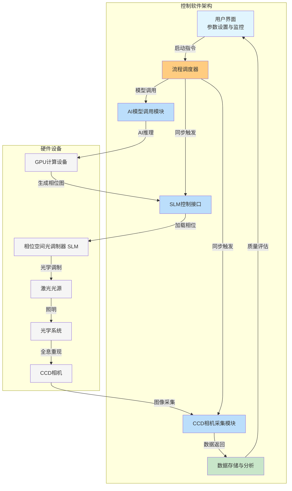
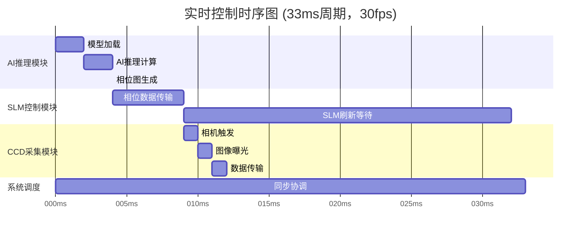
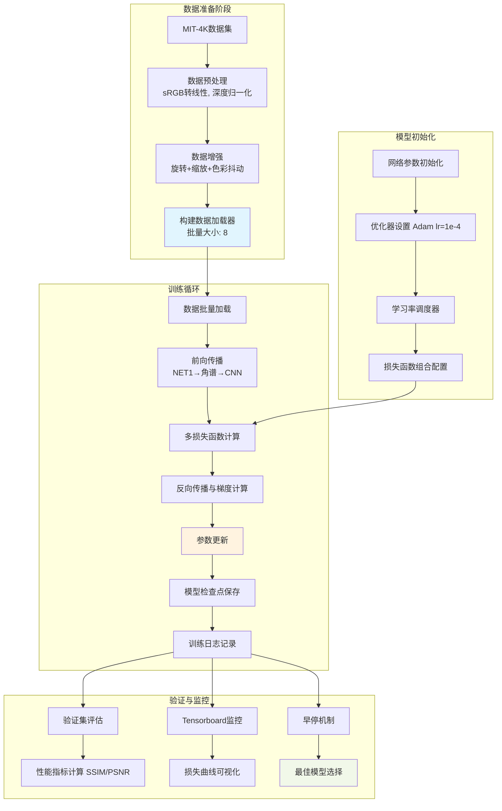
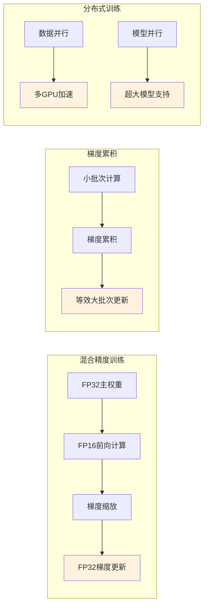
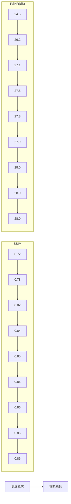
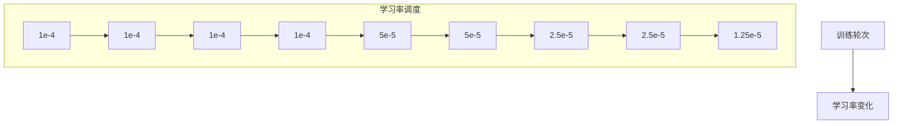
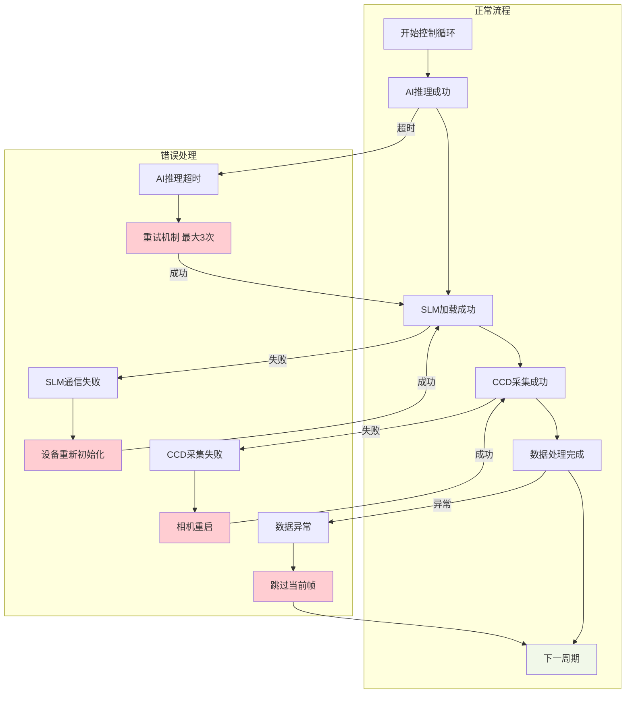
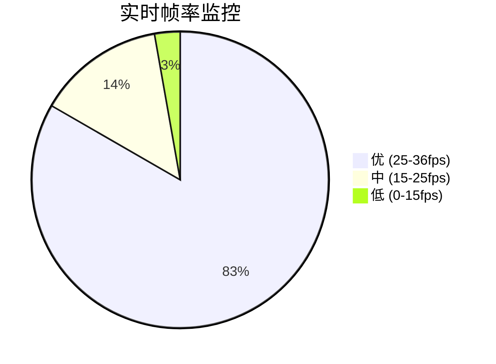
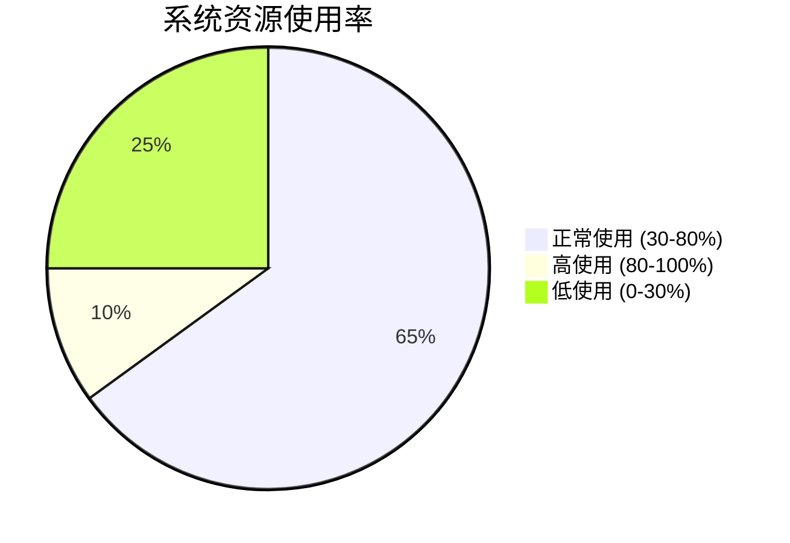

# AI-CGH 系统流程图集

## 1. 控制软件自动化流程

### 全自动化控制流程

### 实时时序控制

## 2. 模型训练详细过程

### 完整训练流程

### 训练优化策略

## 3. 损失函数下降曲线

### 多损失函数变化趋势

```mermaid
flowchart LR
    A[训练轮次] --> B[损失值]
    
    subgraph "总损失"
        direction TB
        T1[0.85] --> T2[0.42] --> T3[0.28] --> T4[0.19] --> T5[0.15] --> T6[0.12] --> T7[0.10] --> T8[0.09] --> T9[0.08]
    end
    
    subgraph "振幅损失"
        direction TB
        A1[0.65] --> A2[0.31] --> A3[0.21] --> A4[0.14] --> A5[0.11] --> A6[0.09] --> A7[0.08] --> A8[0.07] --> A9[0.06]
    end
    
    subgraph "相位损失"
        direction TB
        P1[0.25] --> P2[0.12] --> P3[0.08] --> P4[0.05] --> P5[0.04] --> P6[0.03] --> P7[0.025] --> P8[0.02] --> P9[0.018]
    end
    
    subgraph "感知损失"
        direction TB
        S1[0.18] --> S2[0.09] --> S3[0.06] --> S4[0.04] --> S5[0.03] --> S6[0.025] --> S7[0.02] --> S8[0.016] --> S9[0.014]
    end
```

### 性能指标提升曲线

### 学习率调整过程

## 4. 错误处理与恢复机制

### 系统容错流程

## 5. 系统性能监控

### 实时性能指标

## 使用说明

这些流程图使用Mermaid语法编写，完整展示了AI-CGH系统的：

1. **控制软件自动化流程**：从AI推理到光学重现的完整闭环
2. **模型训练详细过程**：数据准备到模型优化的完整流程
3. **损失函数下降曲线**：多损失函数的训练收敛过程
4. **系统监控与容错**：错误处理和恢复机制

所有图表都可以在支持Mermaid的Markdown查看器中正确渲染显示。